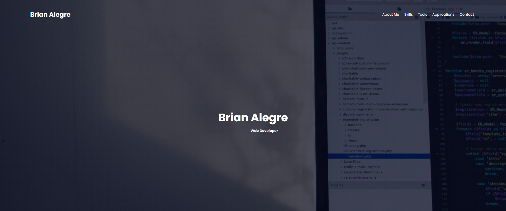

# 02-Advanced-CSS-Homework

# Description
Create a Portfolio Web Page
- Show case skills and talents to employers 
- Deployed projects
- - Link to some github projects

# Site Preview

    

# Github Links
- Repository: https://github.com/brianalegre/02-Advanced-CSS-Homework
- Deployed: https://brianalegre.github.io/02-Advanced-CSS-Homework/

# Requirements:
- Developer's Name
 - Recent photo or avatar
 - Links to sections about them, work, or contact 

- Navigation links to section on the page 
- - Scrolls to the section

- Section with tilted images of develop's applications
- - First application image is bigger than the rest of the applications

- Image application is clickable
- - Takes you to the deployed application

- Mobile compatibility

